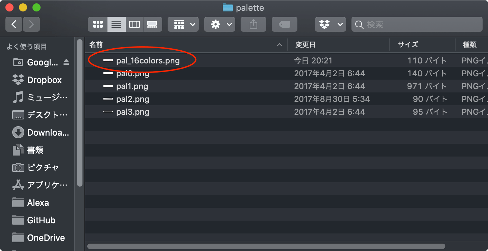
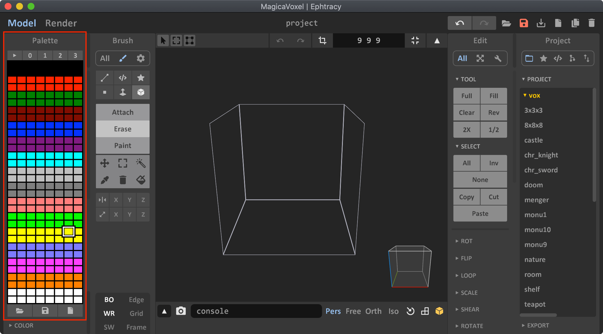

# magicavoxel2mcpi

[Japanese](/README.md)

[English](/README.en.md)

Python script to connect MagicaVoxel to Minecraft PI.


Corresponding version: Minecraft Pi (Raspberry Pi) or Minecraft (JAVA EDITION) + Forge + RaspberryJamMod

## How to use

Create a voxel-model with MagicaVoxel and export "ply" (polygon file format).

Download python-scripts.zip from    

https://github.com/arpruss/raspberryjammod/releases

Unzip python-scripts.zip and copy it to root directory.

```
magicavoxel2mcpi/  
    ├ data/  # ply files
    │    ├ piyo.py  
    │    └ ...
    ├ mcpi/  # add 
    │    ├ block.py  
    │    └ minecraft.py  
    ├ magicavoxel2mcpi.py  
    ├ ...    
    ├ ...    
```

Open the world in Minecraft, then run the following command:

```
cd magicavoxel2mcpi
python magicavoxel2mcpi.py
```

## Colors
You can reproduce 16 colors.

```
colors = [
    [255, 255, 255],  # white
    [255, 127, 0],  # orange
    [255, 0, 255],  # magenta
    [127, 127, 255],  # lightblue
    [255, 255, 0],  # yellow
    [0, 255, 0],  # lime
    [255, 127, 127],  # pink
    [127, 127, 127],  # gray
    [191, 191, 191],  # lightgray
    [0, 255, 255],  # cyan
    [127, 0, 127],  # purple
    [0, 0, 255],  # blue
    [127, 0, 0],  # brown
    [0, 127, 0],  # green
    [255, 0, 0],  # red
    [0, 0, 0],  # black
]
```
It is recommended to use '16 colors only' palette when creating the voxel-model with MagicaVoxel.  
'pal_16colors.png' are contained in the 'images' directory.





## Rotation

```python
# Rotation degree (MagicaVoxel)
alpha = 0  # x-axis
beta = 0  # y-axis
gamma = 0  # z-axis
```

alpha (x-rotation degree)  
beta (y-rotation degree)   
gamma (z-rotation degree)    

Note: It is the coordinate axis of MagicaVoxel not Minecraft.  


## Animation
Create a few voxel-model and copy them to 'data' directory.

Edit magicavoxel2mcpi_animation.py     

```
magicavoxel2mcpi_animation.py
ply_files = ['xxx1.ply', 'xxx2.ply', 'xxx3.ply',...]
```

Open the world in Minecraft, then run the following command:

```
python magicavoxel2mcpi_animation.py
```


## Rotating Animation

Divide the rotating parts, Create a voxel-model and copy them to 'data' directory.

Edit magicavoxel2mcpi_rotation_robot.py or rotation_drone.py to read them.    

```python
# polygon file format exported from MagicaVoxel
body_ply_file = 'robot-body.ply'
head_ply_file = 'robot-head.ply'
hands_ply_file = 'robot-hands.ply'
propeller_ply_file = 'robot-propeller.ply'
```

Adjust the rotating axis.

```python
# shift rotate axis
model_settings['offset_x'] = 0.5
model_settings['offset_y'] = 0.5
model_settings['offset_z'] = 6.5
```
Open the world in Minecraft, then run the following command:

```
python magicavoxel2mcpi_rotation_robot.py
```


## Walking Cat

Create and separate body and limb. Export "ply" and move ".ply" files into "mcpipy" folder    

Edit magicavoxel2mcpi_walking_cat.py    

```python
# polygon file format exported from MagicaVoxel
body_ply_file = 'walking_cat_body.ply'
part_ply_file = 'walking_cat_limbs.ply'
part_reverse_ply_file = 'walking_cat_limbs_reverse.ply'

```

Open the world in Minecraft, then run the following command:

```
python magicavoxel2mcpi_walking_cat.py
```


